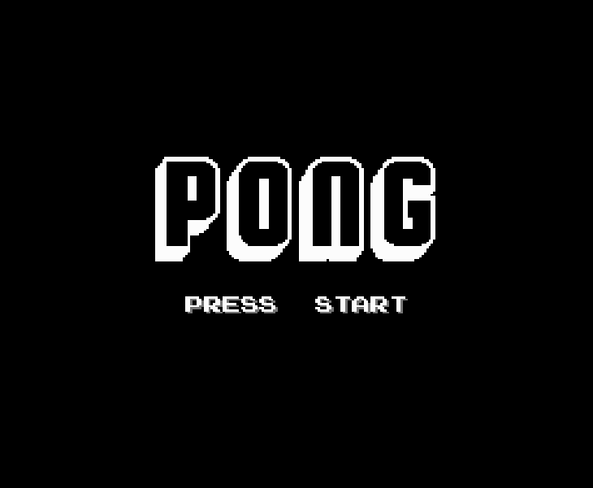
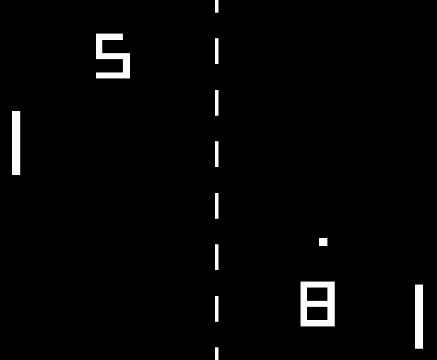
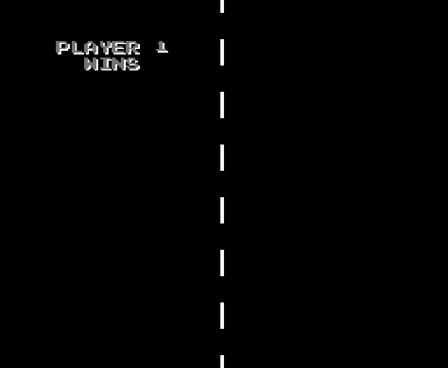

# Pong
A Pong like game made by me for the Nintendo Entertainment System using the 6502 assembly language.

  
   
  

# Resources
A great source of information about anything regarding the NES and game development for the NES is the [Nesdev Wiki](https://www.nesdev.org/wiki/Nesdev_Wiki).

A good introduction to 6502 assembly language by [@Nick Morgan](https://github.com/skilldrick) can be found [here](http://skilldrick.github.io/easy6502/#intro).

The best beginner friendly tutorial, written by Brian Parker, that covers everything you need to get started with making games for the NES can also be found [here](https://nerdy-nights.nes.science/#overview).

# How To Run It
The repo includes a .nes file that can be opened using any NES emulator like [FCEUX](https://fceux.com/web/home.html).

If you want to build it yourself then you need to download this [6502 compiler](https://cc65.github.io/) and run these two commands:

`ca65 pong.asm -o pong.o`

`ld65 pong.o -o pong.nes -t nes`
